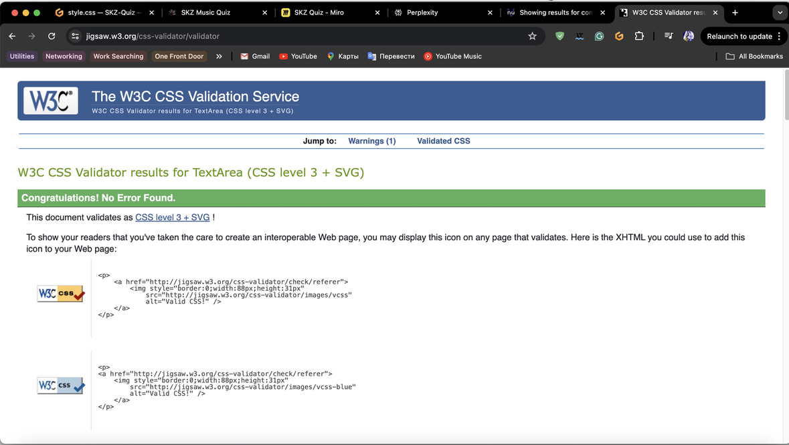

# SKZ Music Quiz

This quiz is designed to test your knowledge of Stray Kids’s discography while having fun.
Stray Kids is a dynamic K-Pop boy band, formed by JYP Entertainment in 2017. They known for their powerful performances and self-produced music. With a unique blend of genres and meaningful lyrics, they have captivated audiences worldwide. 

## UX/UI

- __UX__

The site will be presented as simple but attractive and easy to navigate. 

- __User Stories:__

   -  As a user, I want to enjoy the interface of the website and receive positive experience.
   -  As a user, I want to have the opportunity to play the game on different devices.
   -  As a user, I want to be able to start the quiz so I can play the game.
   -  As a user, I want to see multiple options for answers so I can choose one answer from varieties.
   -  As a user, I want to see if my answer is right or wrong so I will know my progress.
   -  As a user, I want to go further when I guess the song so I don't need to wait while the song ends.
   -  As a user, I want to see my final score so I will know my result.
   -  As a user, I want: to see which answer was correct if I chose the wrong answer so I will learn more in future.
   -  As a user, I want to have a countdown timer so I can see how much time I have for an answer.
   

- __Wireframes__

- Browser View:

- Phone View:

## Features 

Detailing the existing and planned features and the value they bring.

### Existing Features

- __The background Image__

  - Presents a music band to the user

- __The logo of the group image__

  - Let users know the name of band

- __Start Game section__

  - This section is engaging the user to press the button and start the music quiz

- __Game Play section__

  - This section play the song, that user need to guess. It has multiple optins for answer, restart button and next song button.

- __Correct/Wrong answer and Score__

  - When the user presses the button with the answer, it shows if this answer is correct or wrong highlighting the button with green or red color.
  - Also user can see his current score, that icreasing when he presses the correct answer.

  
  

- __The End of the Game section__

   - This section shows the user his final score and proposes to play again.

   
 
- __The Footer__ 

  - The footer section includes links to the relevant social media sites for SKZ Music Quiz game. The links will open to a new tab to allow easy navigation for the user. 
  - The footer is valuable to the user as it encourages them to keep connected via social media

### Features Left to Implement

- Countdown Timer
- Show which answer was correct

## Testing 

In this section, you need to convince the assessor that you have conducted enough testing to legitimately believe that the site works well. Essentially, in this part you will want to go over all of your project’s features and ensure that they all work as intended, with the project providing an easy and straightforward way for the users to achieve their goals.

In addition, you should mention in this section how your project looks and works on different browsers and screen sizes.

You should also mention in this section any interesting bugs or problems you discovered during your testing, even if you haven't addressed them yet.

If this section grows too long, you may want to split it off into a separate file and link to it from here.

### Validator Testing 

- HTML
  - No errors were returned when passing through the official [W3C validator](https://validator.w3.org/#validate_by_input)
  
- CSS
  - No errors were found when passing through the official [(Jigsaw) validator](https://jigsaw.w3.org/css-validator/)
  
- JavaScript
   - No errors were found when passing through the official[JSHint](https://jshint.com/)
- LightHouse
  - The lighthouse test is used to give a score for performance, SEO, accessibility and best practices.
It returned scores of 98, 100, 100 & 100 respectively meaning the performance is optimised.
 

### Unfixed Bugs

You will need to mention unfixed bugs and why they were not fixed. This section should include shortcomings of the frameworks or technologies used. Although time can be a big variable to consider, paucity of time and difficulty understanding implementation is not a valid reason to leave bugs unfixed. 

## Deployment

This section should describe the process you went through to deploy the project to a hosting platform (e.g. GitHub) 

- The site was deployed to GitHub pages. The steps to deploy are as follows: 
  - In the GitHub repository, navigate to the Settings tab 
  - From the source section drop-down menu, select the Master Branch
  - Once the master branch has been selected, the page will be automatically refreshed with a detailed ribbon display to indicate the successful deployment. 

The live link can be found here - [SKZ Music Quiz](http://anka-s.github.io/skz-music-quiz/) 

## Credits 

- I take inspiration for my game from this [Music Quiz](https://github.com/Ezio2994/music-quiz/) 

### Content 

- Icon for webpage created with Favicon generator (https://realfavicongenerator.net/)
- The icons in the footer were taken from [Font Awesome](https://fontawesome.com/)
- The CDN framework used for ready made styling was [Bootstrap 5](https://getbootstrap.com/docs/5.0/getting-started/download/)
- Balsamiq used for wireframe
- [Perplexity](https://www.perplexity.ai/) used for debugging 
- [Miro boards](https://miro.com/app/board/uXjVK1tCs_I=/) used for plunning the work process

### Media

- The photo used for the background taken from [Peakpx](https://www.peakpx.com/) 
- The image for logo taken from [Stick png](https://www.stickpng.com/img/icons-logos-emojis/iconic-brands/stray-kids-logo)
- Songs taken from the Internet [Archive](https://archive.org/search?query=subject%3A%22Stray+Kids%22)

[SKZ Music Quiz](http://anka-s.github.io/skz-music-quiz/)